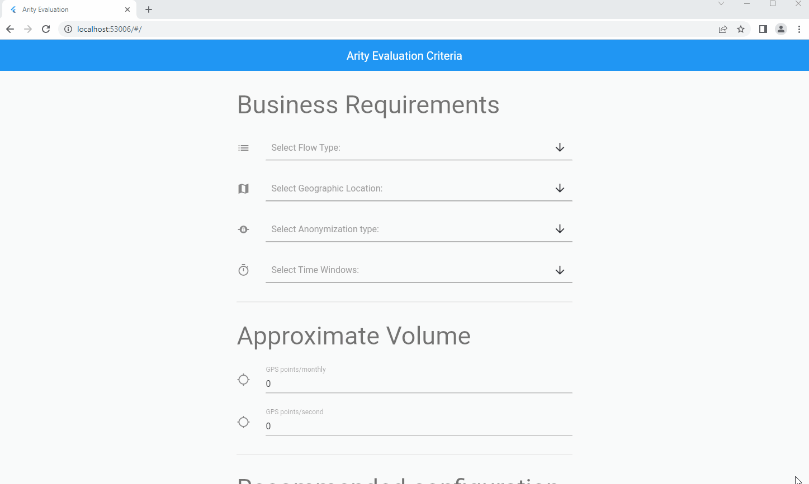

# Web interface for Arity recommended infra
Flutter UI for easily check infra configuration recommended based on business requirements.

You can select many options like time windows, geographic location, anonymization type and specify a volume average.
At the end, you will have a recommended infra for Kafka, Flink and nifi infrastructure you need in order to run the flow.

